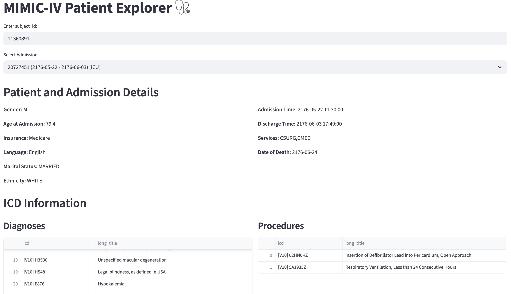
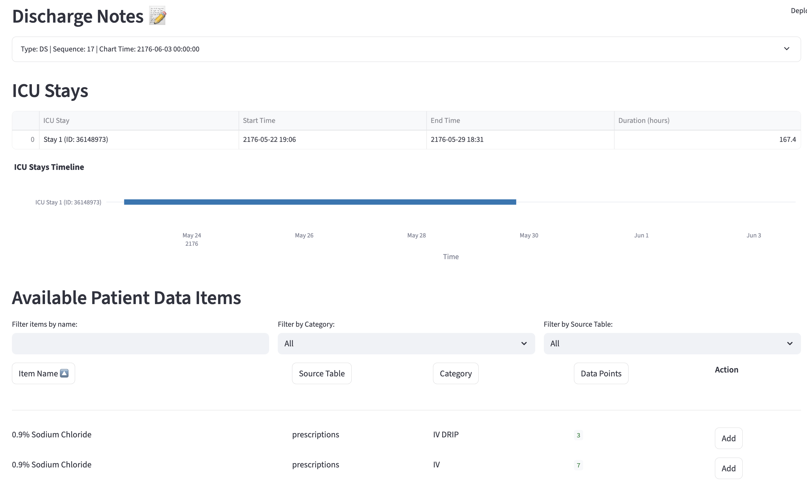
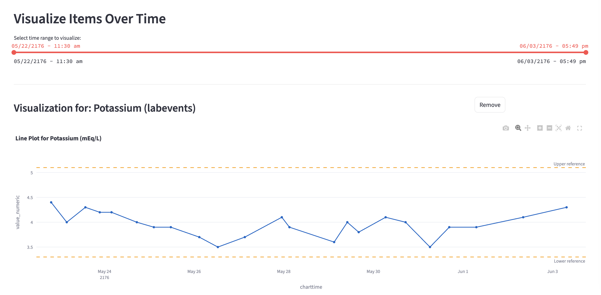

# mimic-visualizer

## Summary
The repo contains a visualizer that lets clinicians or researchers inspect individual admissions from the MIMIC-IV dataset, browse relevant notes and codes, and interactively plot patient data over time.
- Connects to a local MIMIC-IV MySQL database and a MongoDB instance for discharge notes.
- Provides a web interface where you enter a subject_id and pick a hospital admission to explore. Patient demographics, insurance, language, and admission/ICU details are displayed.
- Shows ICD diagnoses, procedures, and any discharge notes retrieved from MongoDB. ICU stays are visualized on an interactive timeline, with a marker for patient death if applicable.
- Lists all available data items across chart events, lab results, and prescriptions. You can filter or sort items, add them to a selection, and scroll through paginated results.
- Allows you to pick a time range during the admission and plot the selected items as trends, events, or timelines, enabling quick inspection of vital signs, lab values, or medication orders.

## Usage
- Following the instruction in [mimic-code](https://github.com/MIT-LCP/mimic-code/tree/main/mimic-iv/buildmimic/mysql) to populate the mimic-iv dataset to mysql databse.
-  Run script `scripts/load_mimic_note_to_mongo.py` to populate the mimic-iv-node discharge notes to mongo
-  Run script `scripts/load_mimic_ecg_to_mongo.py` to populate the mimic-iv-ecg ECG machine_measurement to mongo
- Run `pip install -r requirement.txt` to install the dependency
- Run `streamlit run app.py -- --mysql-host YOUR_HOST --mysql-user YOUR_USER --mysql-password YOUR_PASSWORD --mongo-uri YOUR_MONGO_URI` to start the server

## Examples

